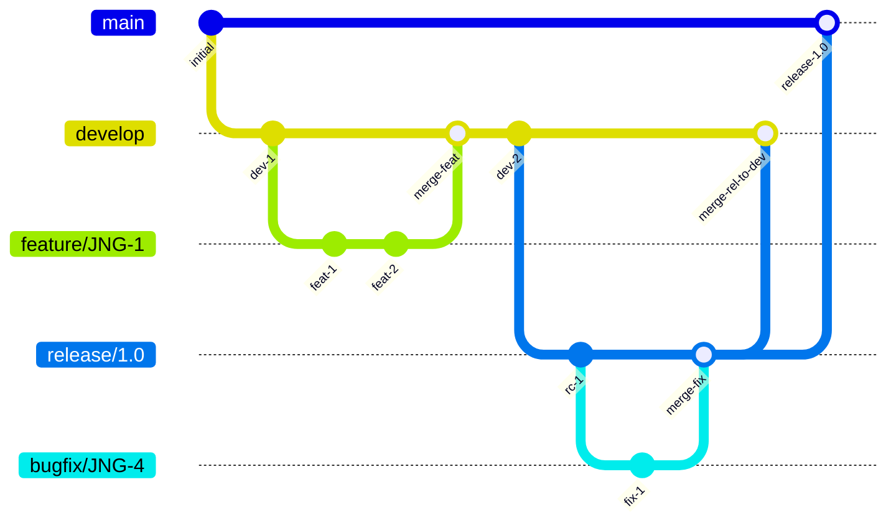
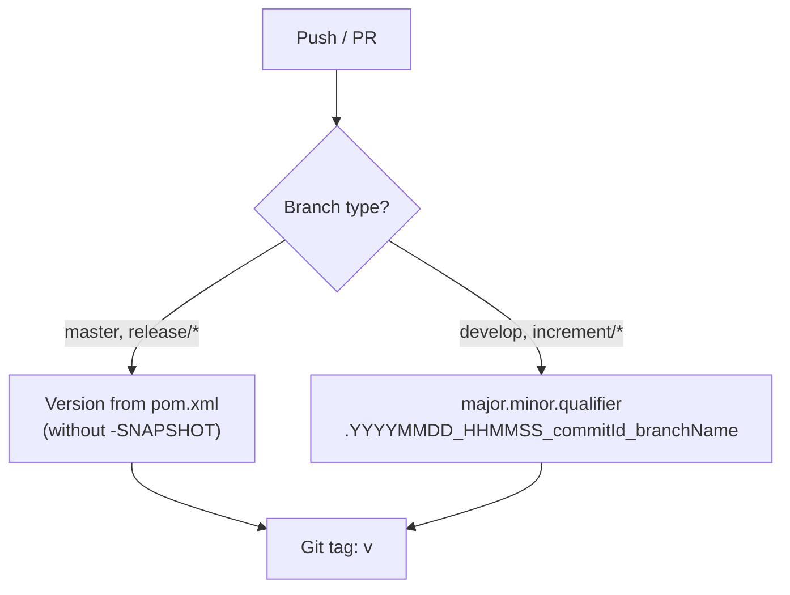
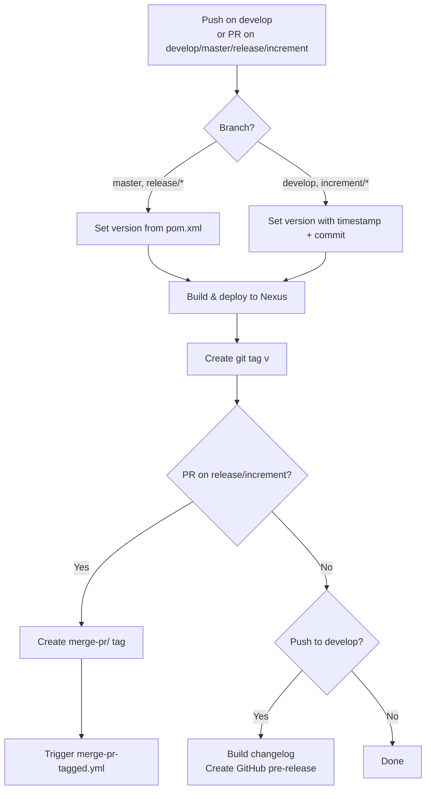
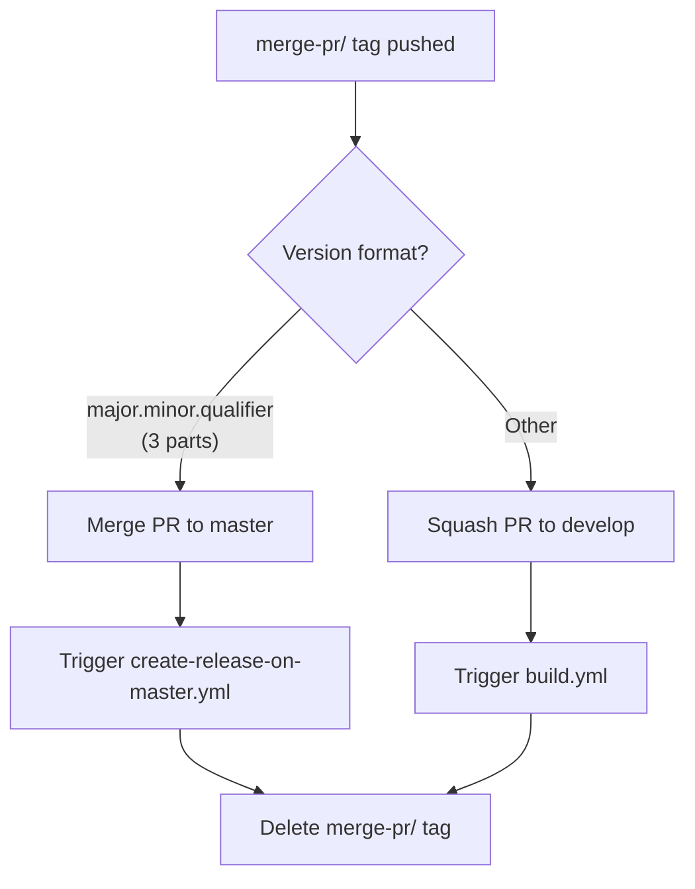
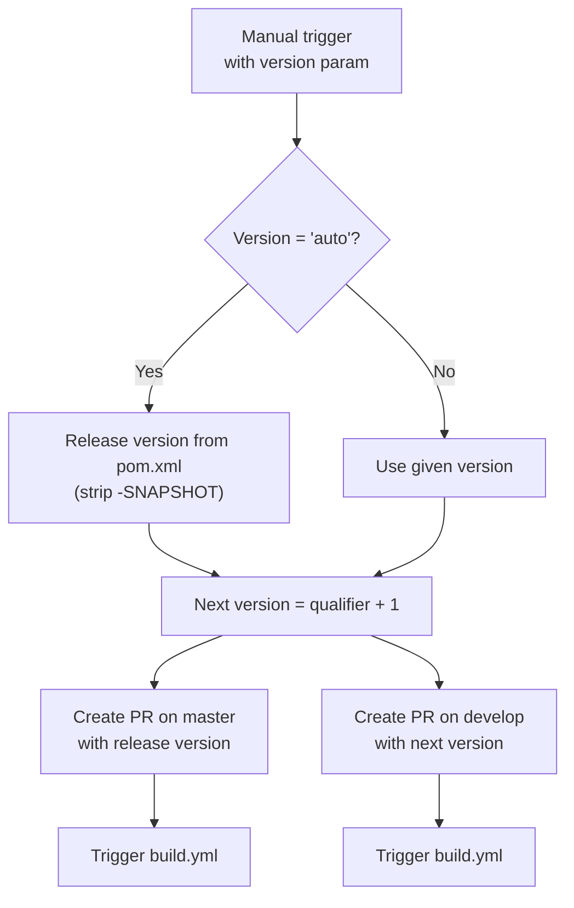

# CI Flow — Development Versions and Branch Handling

This document describes the branching strategy, version numbering, and CI/CD pipeline for the epsilon-runtime-eclipse project.

## Branching Strategy

The project uses **GitFlow** ([reference](https://www.atlassian.com/git/tutorials/comparing-workflows/gitflow-workflow)) with the following branch types:

| Branch | Purpose | Base |
|--------|---------|------|
| `develop` | Latest development sources of the active version | — |
| `feature/JNG-NUMBER_short_summary` | New feature development | `develop` |
| `release/*` (e.g. `1_0_beta1`) | Release stabilization and testing | `develop` |
| `bugfix/JNG-NUMBER_short_summary` | Fixes applied to release branches during testing | `release/*` |
| `support/JNG-NUMBER_short_summary` | Minor changes for a previous release | `release/*` |
| `master` | Latest released (stable) sources | — |
| `hotfix/JNG-NUMBER_short_summary` | Emergency fixes applied to `master` | `master` |

### Branch Flow

## Version Numbers

Version numbers follow **semantic versioning** with these rules:

| Event | Version Action |
|-------|---------------|
| Start a `feature/` branch | No version change (inherits from `develop`) |
| Start a `release/` branch | Increment 2nd number on `develop` |
| Start a `bugfix/` branch | No version change (applied on release branch) |
| Start a `support/` branch | Increment 3rd number |
| Start a `hotfix/` branch | Increment 4th number |

### CI Version Calculation

The CI pipeline calculates versions dynamically depending on the branch:

## GitHub Actions Workflows

### build.yml — Main Build Pipeline

**Triggers:** Push to `develop`, PRs targeting `develop`, `master`, `release/*`, or `increment/*`.

**Build steps:**
1. Checkout (depth 2) with JDK 21 (Zulu)
2. Configure Maven settings with `judong-nexus` mirror
3. Calculate version dynamically
4. Build and deploy artifacts to `nexus.judo.technology`
5. Upload P2 repository to `p2-judong` Nexus repo
6. Create GitHub release with changelog (develop only)

### merge-pr-tagged.yml — Auto-merge Release PRs

**Trigger:** Push of a `merge-pr/*` tag.

### release.yml — Release Orchestration

**Trigger:** Manual dispatch with a version parameter (`auto` or explicit `major.minor.qualifier`).

### create-release-on-master.yml

**Trigger:** Push to `master`. Builds a changelog and creates a GitHub release (marked as latest).

### Other Workflows

| Workflow | Purpose | Trigger |
|----------|---------|---------|
| `bump-version.yml` | Bump version numbers | Manual dispatch |
| `build-dependabot.yml` | Build Dependabot PRs | Dependabot PRs |
| `jira-description-to-pr.yml` | Sync JIRA description to PR body | Manual trigger |
| `delete-old-draft-releases.yml` | Clean up stale draft releases | Scheduled |
| `sync-labels.yml` | Sync issue labels | Scheduled |

## Development Rules

> **Important:** There is no commit without a ticket number. Every commit and PR must include `JNG-xxx` referencing a [JIRA](https://blackbelt.atlassian.net/jira/) ticket.
