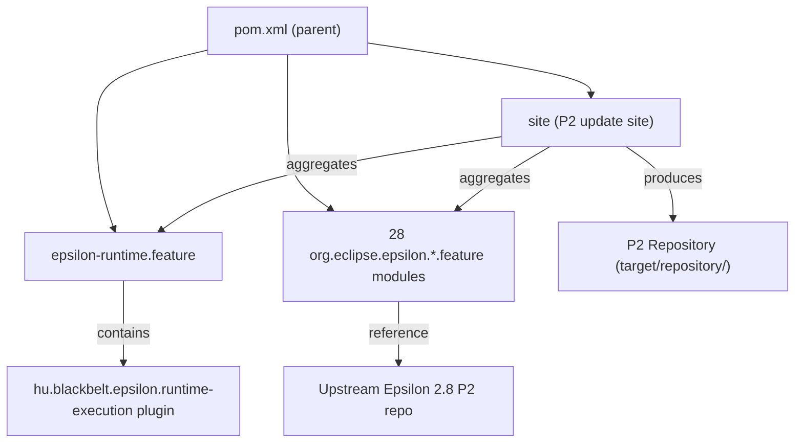
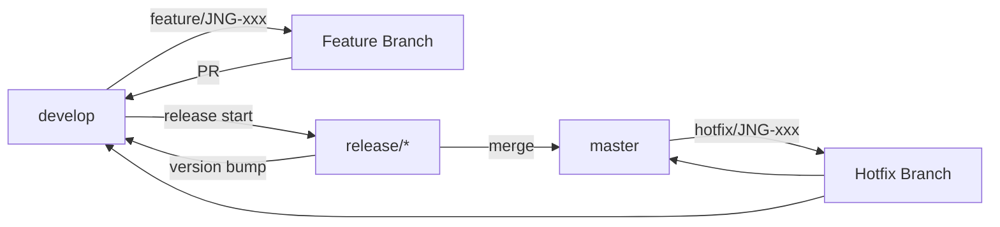

# Contributing to epsilon-runtime-eclipse

This guide covers everything you need to get started contributing to the project: setting up your environment, understanding the code structure, and submitting changes.

## Development Environment

### Required Software

| Tool | Version | Notes |
|------|---------|-------|
| **JDK** | 21 LTS | [Zulu JDK](https://www.azul.com/downloads/?version=java-21-lts&package=jdk) recommended |
| **Maven** | 3.9.4+ | Maven Wrapper (`./mvnw`) is included — no separate install needed |

Verify your setup:

```sh
java -version
# Expected: openjdk version "21.x.x" ...

./mvnw -version
# Expected: Apache Maven 3.9.4+ ...
```

### JVM Configuration

The build requires additional JVM flags (already configured in `.mvn/jvm.config`):

- `-Xms1024m -Xmx2048m` — heap size for building the large P2 site
- `--add-opens` flags for `java.lang`, `java.util`, `java.time` — required by test frameworks on JDK 21

## Code Structure

This is a Maven multi-module project using **Tycho** to build Eclipse features. There is no custom Java source code in most modules — they are feature descriptors that package upstream Eclipse Epsilon plugins.



### Key Files Per Feature Module

| File | Purpose |
|------|---------|
| `pom.xml` | Maven coordinates, parent reference |
| `src/main/resources/feature.xml` | Eclipse feature descriptor — lists included plugins and imported dependencies |
| `.project` | Eclipse project metadata |

### The `site` Module

The `site` module is the most complex. Its `pom.xml` (800+ lines) uses the `p2-maven-plugin` to:

1. Pull 112+ artifacts from Maven Central and the Epsilon P2 repository
2. Bundle them into a P2 update site with categories defined in `category.xml`
3. Optionally upload to `https://nexus.judo.technology/repository/p2-judong/` via the `release-p2-judong` profile

## Build Commands

```sh
# Full build (all modules + P2 site)
./mvnw clean install

# Tests only
./mvnw clean test

# Single module
./mvnw clean install -pl org.eclipse.epsilon.emf.feature

# Skip tests
./mvnw clean install -DskipTests
```

### Maven Profiles

| Profile | Purpose |
|---------|---------|
| `sign-artifacts` | GPG-sign artifacts for release |
| `release-dummy` | Deploy to local `/tmp/` directory for testing |
| `release-judong` | Deploy to judong Nexus (`nexus.judo.technology`) |
| `release-central` | Deploy to Maven Central via Sonatype OSSRH |
| `release-p2-judong` | Upload P2 site to judong Nexus via WebDAV |
| `generate-github-asciidoc-diagrams` | Generate PNG diagrams from AsciiDoc using PlantUML |
| `update-source-code-license` | Update EPL-2.0 license headers in source files |

## Submitting an Issue

Before submitting, search the [issue tracker](https://github.com/BlackBeltTechnology/epsilon-runtime-eclipse/issues) — your problem may already be reported or resolved.

When filing a bug, include:
- Output of `java -version` and `mvn -version`
- Relevant `pom.xml` or `.flattened-pom.xml`
- A minimal reproduction case that demonstrates the failure

## Submitting a Pull Request

This project follows [GitHub's standard forking model](https://guides.github.com/activities/forking/). Fork the repository, create a feature branch, and submit a pull request.

> **Important:** Every commit and PR must reference a JIRA ticket number (`JNG-xxx`). See the [CI Flow documentation](.github/CIFLOW.md) for the full branching strategy.

### Branch and CI Workflow



All PRs trigger the CI build (`build.yml`), which compiles, tests, and deploys snapshot artifacts. Release branches produce stable version numbers; develop builds append a timestamp and commit ID.
