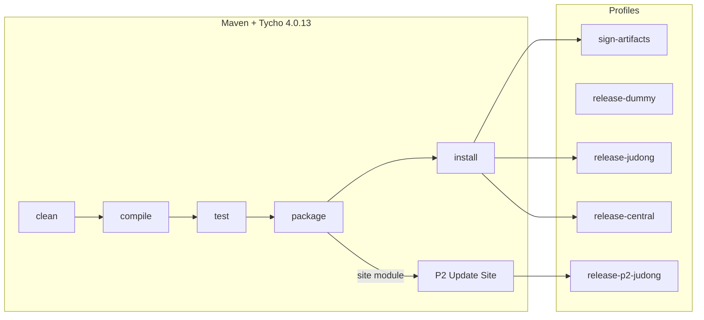
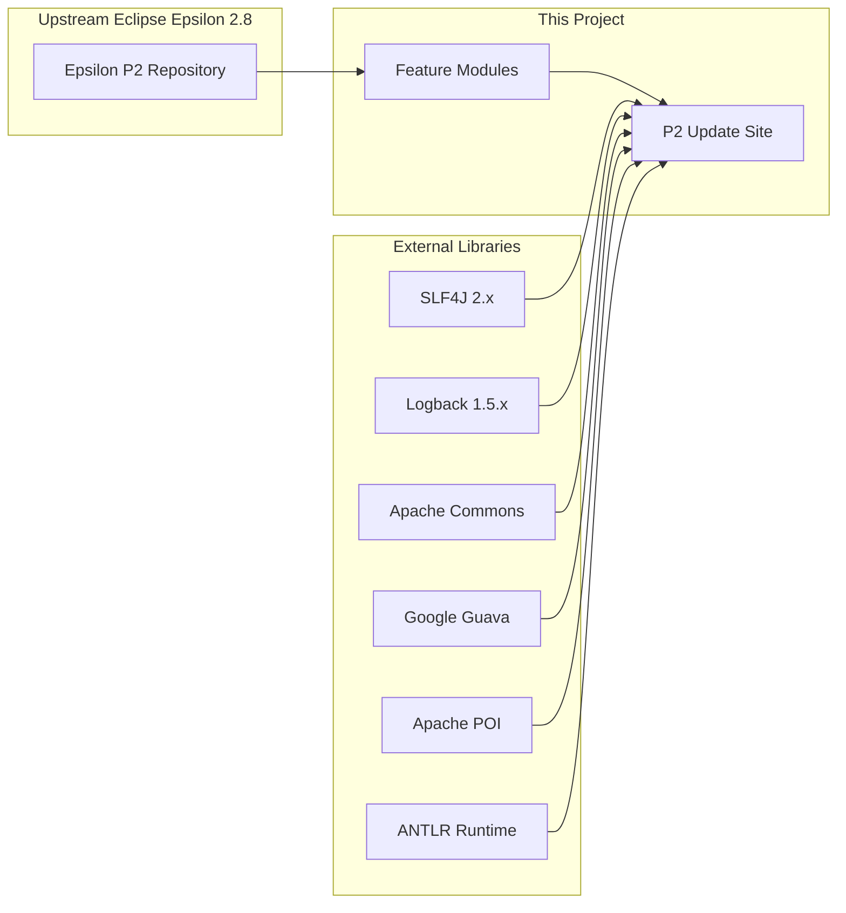

# epsilon-runtime-eclipse

[](https://github.com/BlackBeltTechnology/epsilon-runtime-eclipse/actions/workflows/build.yml)

This project packages the [Eclipse Epsilon](https://www.eclipse.org/epsilon/) model transformation framework as a set of Eclipse features and a P2 update site. It wraps the Epsilon execution engine into an Eclipse plugin, making it installable from an update site or embeddable in Eclipse-based products.

## What is Epsilon?

Epsilon is a family of languages and tools for **code generation**, **model-to-model transformation**, **model validation**, **comparison**, **migration**, and **refactoring**. It works out of the box with EMF, UML, Simulink, XML, and other model types.

### Supported Language Dialects

| Dialect | Full Name | Purpose |
|---------|-----------|---------|
| **EOL** | Epsilon Object Language | General-purpose model querying and modification |
| **ETL** | Epsilon Transformation Language | Model-to-model transformation |
| **EVL** | Epsilon Validation Language | Model validation and constraint checking |
| **EGL** | Epsilon Generation Language | Template-based code generation |
| **EGX** | Epsilon Generation XML | Rule-based orchestration for EGL templates |
| **EML** | Epsilon Merging Language | Model merging |
| **ECL** | Epsilon Comparison Language | Model comparison |

> **Tip:** For a comprehensive guide to the Epsilon language stack, read the free [Epsilon Book](https://www.eclipse.org/epsilon/doc/book/).

## Project Structure

The project is a Maven multi-module build using Tycho to produce Eclipse features and a P2 update site.

```mermaid
graph TD
    subgraph "Custom Runtime"
        RF[epsilon-runtime.feature]
    end

    subgraph "Epsilon Core"
        CF[core.feature]
        CDT[core.dt.feature]
    end

    subgraph "Model Connectors"
        EMF[emf.feature]
        CSV[emc.csv.feature]
        HTML[emc.html.feature]
        GML[emc.graphml.feature]
        JDT[emc.jdt.feature]
        XLS[emc.spreadsheets.feature]
        SIM[simulink.feature]
        UML[uml.feature]
    end

    subgraph "Additional Features"
        FLX[flexmi.feature]
        HUTN[hutn.feature]
        PIC[picto.feature]
        SIR[sirius.widget.feature]
        EVL[evl.emf.validation.feature]
        EWL[ewl.emf.feature]
    end

    SITE[site — P2 Update Site]

    RF --> SITE
    CF --> SITE
    CDT --> SITE
    EMF --> SITE
    CSV --> SITE
    HTML --> SITE
    GML --> SITE
    JDT --> SITE
    XLS --> SITE
    SIM --> SITE
    UML --> SITE
    FLX --> SITE
    HUTN --> SITE
    PIC --> SITE
    SIR --> SITE
    EVL --> SITE
    EWL --> SITE
```



### Module Categories

| Category | Modules | Description |
|----------|---------|-------------|
| **Custom Runtime** | `epsilon-runtime.feature` | BlackBelt's runtime feature wrapping the Epsilon execution engine (`hu.blackbelt.epsilon.runtime-execution`) |
| **Core** | `core.feature`, `core.dt.feature` | Epsilon parsers, execution engines, and Eclipse development tools |
| **EMF Integration** | `emf.feature`, `emf.dt.feature`, `evl.emf.validation.feature`, `ewl.emf.feature`, `ewl.gmf.feature`, `eunit.dt.emf.feature` | EMF-based model management, validation, and GMF editor support |
| **Model Connectors** | `emc.csv.*`, `emc.graphml.*`, `emc.html.*`, `emc.jdt.*`, `emc.spreadsheets.*` | Drivers for CSV, GraphML, HTML, Java (JDT), and Excel models |
| **Other Formats** | `flexmi.*`, `hutn.*`, `uml.*`, `simulink.*`, `picto.*`, `sirius.widget.*` | FlexMI, HUTN, UML, Simulink, visualization, and Sirius widget support |
| **Update Site** | `site` | Aggregates all features into a P2 repository with 17 categories and 112+ artifacts |

## Build Commands

This project uses Maven with a Maven Wrapper. **JDK 21** (Zulu distribution) is required.

```sh
# Full build
./mvnw clean install

# Run tests only
./mvnw clean test

# Build a single module
./mvnw clean install -pl <module-name>

# Skip tests
./mvnw clean install -DskipTests
```

### Build Architecture



### Key Dependency Flow



## Contributing

Everyone is welcome to contribute! See [CONTRIBUTING.md](CONTRIBUTING.md) for details on submitting issues and pull requests, and [CI Flow](.github/CIFLOW.md) for the branching and CI/CD strategy.

## License

This project is licensed under the [Eclipse Public License 2.0](https://www.eclipse.org/org/documents/epl-2.0/EPL-2.0.txt).
